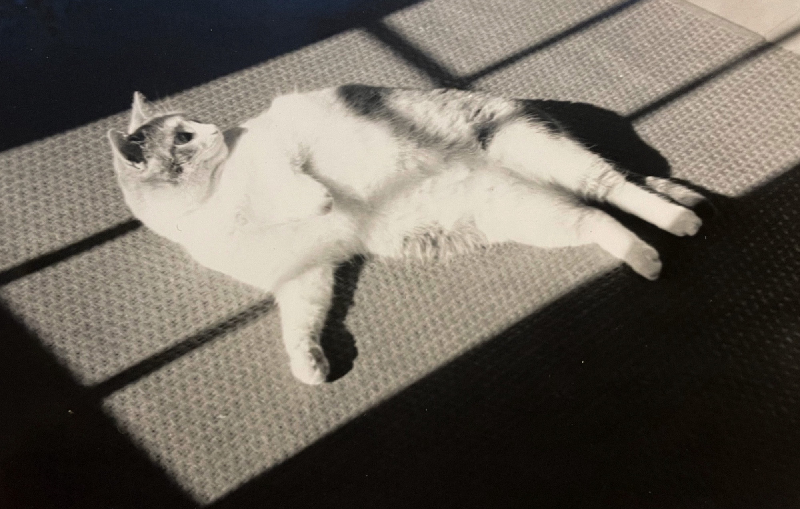

<h1 align="center">
  
</h1>

  <strong>
    ✨ <code style="color:#8A2BE2;">println!</code>
    (<code style="color:#6495ED;">"Hello, ✧ World!"</code>); ✨
  </strong>

---

    

---

## 🚀 About Me  
🔬 **Computer Science & Math** major at **Wilfrid Laurier University**  
📊 Passionate about **AI, Mathematical Modeling & ML Optimization**  
🔢 Researching **Functional Differential Equations & Mathematical Biology**  

💡 **What I Love Building**:  
- **AI-powered** applications with Rust & Python 🦀  
- **Complex algorithmic challenges** (Competitive programming, Math-heavy models)  
- **High-performance, low-level systems** using C++ and Rust  

---

## 🛠 Tech Stack & Tools

<table align="center">
  <tr>
    <td align="center"> Rust</td>
    <td align="center"> Python</td>
    <td align="center"> C++</td>
    <td align="center"> Java</td>
    <td align="center"> SQL</td>
  </tr>
  <tr>
    <td align="center"> Tailwind CSS</td>
    <td align="center"> Firebase</td>
    <td align="center"> Next.js</td>
    <td align="center"> Docker</td>
    <td align="center"> Linux</td>
  </tr>
</table>

---

## 📫 Let's Connect!

    
    
    

---