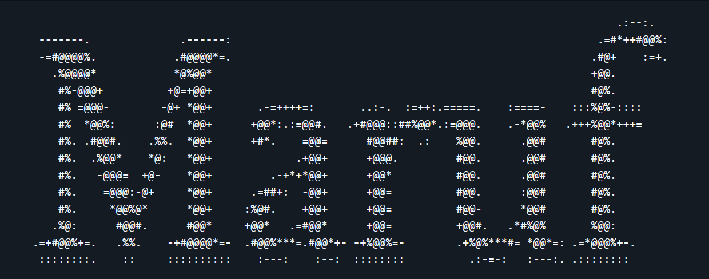

 

💡 Fun fact: This ASCII art was generated using my own app —  
<a href="https://image-to-ascii-14.streamlit.app/" target="_blank">try it live here</a>

---
Specializing in systems design and architecture, with a growing interest in quantitative methods and the long-term goal of becoming a quant.
---
**Tech**  
`C`  `C++`  `Python`  `Java`  `Go`  `SQL`  `Rust`  `Next.js`  `Tailwind CSS`  `Docker`  `Linux`  `Firebase`

---

**Connect**  
[GitHub](https://github.com/MarufHossain14) · [LinkedIn](https://www.linkedin.com/in/maruf-hossain-wlu) · [Email](mailto:hossain186.maruf@gmail.com)

